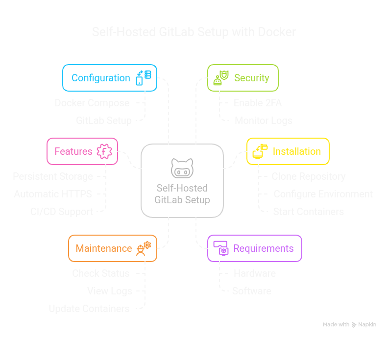

# 🐙 Self-Hosted GitLab with Docker & CI/CD Runners


A complete containerized GitLab CE solution with integrated Docker-based GitLab Runners, automatic HTTPS, and optional monitoring support.

### Overview


---

## 📚 Table of Contents

- [Features](#features)
- [Requirements](#requirements)
- [Installation](#installation)
- [Configuration](#configuration)
- [GitLab Setup](#gitlab-setup)
- [CI/CD Configuration](#cicd-configuration)
- [Maintenance](#maintenance)
- [Troubleshooting](#troubleshooting)
- [Security](#security)
- [Backup & Recovery](#backup--recovery)
- [Support](#support)

---

## 🚀 Features

- 🐳 Full GitLab CE running in Docker with persistent storage  
- ⚡ Integrated GitLab Runner using Docker executor  
- 🔐 Automatic HTTPS via Let's Encrypt  
- 🐳 Docker-in-Docker (DinD) CI/CD support  
- 📊 Optional monitoring stack (Prometheus + Grafana)  

---

## 🖥️ Requirements

### Hardware

- 4 CPU cores (minimum)
- 8GB RAM (16GB recommended)
- 50GB+ disk space

### Software

- Docker Engine 20.10+
- Docker Compose 2.0+
- Linux host (Ubuntu 20.04+ recommended)

---

## 🛠️ Installation

### 1. Clone the Repository

```bash
git clone https://github.com/your-repo/gitlab-docker.git
cd gitlab-docker
```

### 2. Configure the Environment

```bash
cp .env.example .env
nano .env
```

#### Example `.env`

```ini
# GitLab Configuration
GITLAB_ROOT_PASSWORD=YourSecurePassword123!
EXTERNAL_URL=https://gitlab.yourdomain.com
LETS_ENCRYPT_EMAIL=admin@yourdomain.com

# Runner Configuration
RUNNER_REGISTRATION_TOKEN=your_runner_token
DOCKER_NETWORK_MODE=bridge
```

### 3. Start the Containers

```bash
docker-compose up -d
```

🕒 *Wait 5–10 minutes for the initial GitLab setup to complete.*

---

## ⚙️ Configuration

### `docker-compose.yml` Highlights

```yaml

services:
  gitlab-server:
    image: 'gitlab/gitlab-ce:latest'
    container_name: gitlab-server
    environment:
      GITLAB_ROOT_USERNAME: "${GITLAB_USERNAME}"
      GITLAB_ROOT_EMAIL: "${GITLAB_EMAIL}"
      GITLAB_ROOT_PASSWORD: "${GITLAB_PASSWORD}"
      GITLAB_OMNIBUS_CONFIG: |
        external_url 'http://localhost:8000'
        nginx['listen_port'] = 8000
        gitlab_rails['gitlab_shell_ssh_port'] = 2222
    ports:
      - '8000:8000'
      - '2222:22'
    volumes:
      - ./gitlab/config:/etc/gitlab
      - ./gitlab/data:/var/opt/gitlab
    networks:
      - gitlab-in-docker

  gitlab-runner:
    image: gitlab/gitlab-runner:alpine
    container_name: gitlab-runner
    network_mode: 'host'
    volumes:
      - /var/run/docker.sock:/var/run/docker.sock

networks:
  gitlab-in-docker:
    name: gitlab-in-docker
    driver: bridge```

---

## 🧩 GitLab Setup

### First Login

Access your GitLab instance at:  
🔗 `https://your-gitlab-domain.com`

Login credentials:

- **Username:** `root`  
- **Password:** As defined in `.env`

### Recommended Initial Steps

- 🔒 Change the root password (User Settings)
- ✉️ Configure SMTP (Admin Area → Settings → Email)
- 💾 Set up automatic backups (Admin Area → Settings → Repository)

---

## 🔁 CI/CD Configuration

### Registering a Runner (Manual Method)

If the runner is not auto-registered, use:

```bash
docker exec -it gitlab-runner gitlab-runner register   --non-interactive   --url "https://gitlab.yourdomain.com"   --registration-token "PROJECT_REGISTRATION_TOKEN"   --executor "docker"   --docker-image "docker:latest"   --docker-volumes "/var/run/docker.sock:/var/run/docker.sock"   --description "Docker Runner"
```

### Sample `.gitlab-ci.yml`

```yaml

stages:
  - test
  - build
  - deploy

variables:
  IMAGE_NAME: gideontee/gitlab-demo # specify your image here
  IMAGE_TAG: flask-app-v1

run_tests:
  image: python:3.9-slim-buster
  stage: test
  before_script:
    - apt-get update
    - apt-get install make -y
  script:
    - make test

build_image:
  tags:
    - local machine
  stage: build

  before_script:
    - echo "$DOCKER_PASS" | docker login -u $DOCKER_USER --password-stdin

  script:
    - docker build -f build/Dockerfile -t $IMAGE_NAME:$IMAGE_TAG .
    - docker push $IMAGE_NAME:$IMAGE_TAG

deploy:
  stage: deploy
  variables:
    SERVER_IP: 184.72.122.179 # server's public ip
  before_script:
    - chmod 400 $SSH_PEM
  script:
    - ssh -o StrictHostKeyChecking=no -i $SSH_PEM ubuntu@$SERVER_IP "
      docker login -u $DOCKER_USER -p $DOCKER_PASS &&
      docker run -d -p 5000:5000 --rm --name flask_server $IMAGE_NAME:$IMAGE_TAG
      "
```

---

## 🧰 Maintenance

| Task              | Command                                        |
|-------------------|------------------------------------------------|
| Check status      | `docker-compose ps`                            |
| View logs         | `docker-compose logs -f`                       |
| Update containers | `docker-compose pull && docker-compose up -d` |
| Restart services  | `docker-compose restart`                       |


## 🔐 Security Best Practices

- ✅ Enable 2FA for all users
- 🔄 Regularly update GitLab and Runner containers
- 🔥 Enable firewall:

```bash
sudo ufw allow 80,443,2222/tcp
sudo ufw enable
```

- 📋 Monitor logs:

```bash
docker logs gitlab --tail 50 -f
```

---

## 🧯 Backup & Recovery

### Create a Backup

```bash
docker exec -it gitlab gitlab-backup create
```

### Restore a Backup

1. Copy the backup tar file to `./data/gitlab/data/backups/`
2. Run:

```bash
docker exec -it gitlab gitlab-backup restore BACKUP=timestamp_of_backup
```

---

## 🛠️ Troubleshooting

### 1. 502 Error on First Start

```bash
docker logs gitlab -f
```

🕓 GitLab may take several minutes to become fully ready.

### 2. Runner Not Connected

```bash
docker exec -it runner gitlab-runner verify
```

---

## 🧠 Support

For additional help:

- 📚 [GitLab Docker Documentation](https://docs.gitlab.com/omnibus/docker/)
- 🏃 [GitLab Runner Docs](https://docs.gitlab.com/runner/)

---

